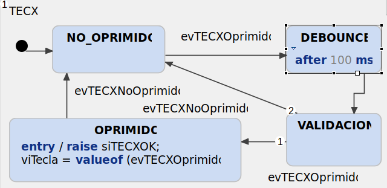
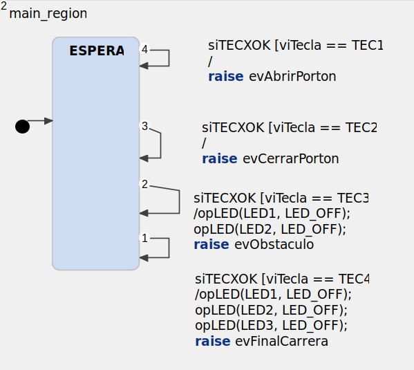
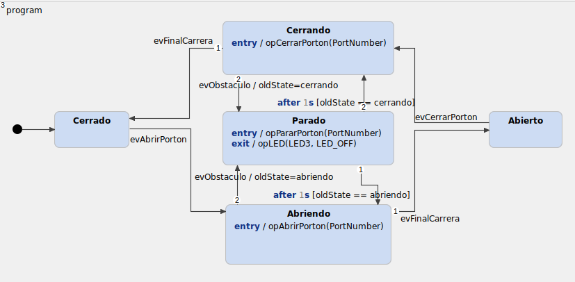
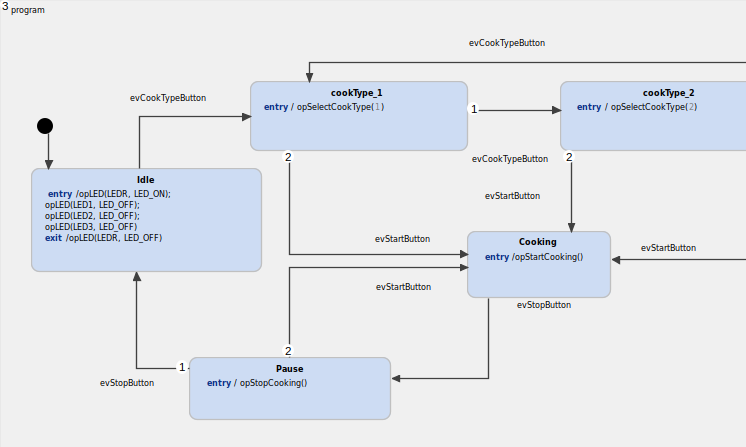
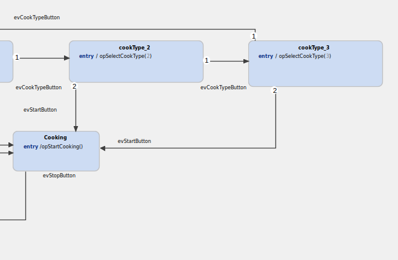

# Trabajo Práctico 1

## Sistemas Embebidos - 2C2021 - Grupo 1

|       Integrante       | Padrón |        Mail        |
|:----------------------:|:------:|:------------------:|
|     Aupi, Santiago     |   100793  |   saupi@fi.uba.ar  |
| Piperno, Ignacio Tomás | 100677 | ipiperno@fi.uba.ar |
|    Rossi, Francisco    |  99540 |  frrossi@fi.uba.ar |

## Índice

- [Trabajo Práctico 1](#trabajo-práctico-1)
  - [Sistemas Embebidos - 2C2021 - Grupo 1](#sistemas-embebidos---2c2021---grupo-1)
  - [Índice](#índice)
- [Resumen](#resumen)
- [Funciones auxiliares](#funciones-auxiliares)
  - [TECX](#tecx)
  - [main_region](#main_region)
- [Ejercicio 3](#ejercicio-3)
- [Ejercicio 4](#ejercicio-4)
- [Ejercicio 5](#ejercicio-5)
- [Ejercicio 6](#ejercicio-6)
- [Ejercicio 7](#ejercicio-7)
- [Ejercicio 8](#ejercicio-8)


# Resumen

En este repositorio se desarrollará el trabajo práctico numero 1 de la materia 86.65 - Sistemas Embebidos, FIUBA. El mismo consiste de 6 ejercicios, cuyas resoluciones podrán encontrar en este repositorio. En este informe desarrollaremos la explicación de cada uno de los ejercicios.

# Funciones auxiliares

En los diferentes ejercicio desarrollados, utilizaremos dos bloques de maquina de estados ya desarrollada, que nos permiten interactuar con el programa mediante la botonera de la placa `EDU-CIAA-NXP`.

## TECX

Este pedazo de codigo nos permite detectar si un pulsador es accionado, tiene un debouncer incorporado y nos devuelve un valor determinado dependiendo de qué pulsador es el que disparó el evento.

|    TEC4   |    TEC3   |    TEC2   |    TEC1   |
|:---------:|:---------:|:---------:|:---------:|
| 8 [b1000] | 4 [b0100] | 2 [b0010] | 1 [b0001] |

El diagrama de la maquina de estados es:



## main_region

En la `main_region` tenemos el "handler" de los eventos dados por TECX, donde dependiendo del ejercicio que estemos resolviendo cambiara levemente, pero fundamentalmente se define qué hacer para cada uno de los pulsadores, a continuación, como ejemplo podemos ver `main_region` del [Ejercicio 5](#ejercicio-5)



# Ejercicio 3

> Implementar (editar, simular y generar el código) el modelo de control de Panel de Control de un generador de señales (tensión de 0 a
10V, frecuencia de 20 a 20.000Hz y 3 formas de señal).
>
> 1. Editar y simular
> 2. Generación de código

# Ejercicio 4

> Implementar (editar, simular y generar el código) el modelo de control de Puerta Corrediza automatizada (motor con movimiento en dos
sentidos, sensor de presencia y fines de carrera)
>
> 1. Editar y simular
> 2. Generación de código

# Ejercicio 5

> Implementar (editar, simular y generar el código) el modelo de control de Portón Levadizo automatizado (motor con movimiento en dos
sentidos, control remoto de apertura/cierre, fines de carrera y señalización luminosa)
>
> 1. Editar y simular
> 2. Generación de código

Autor: Francisco Rossi

***
Codigo fuente: [ej5](ej5)

Teniendo en cuenta el enunciado se definen los siguientes eventos:

1. `evCerrarPorton`:
    El mismo define el evento de indicar con el control remoto que se cierre la puerta.

2. `evAbrirPorton`
    Este se define al igual que el anterior, pero cuando se indicar de abrir la puerta.

3. `evFinalCarrera`
    Este evento indica que se detecto un final de carrera, puede ser tanto el de subida como el de bajada.

4. `evObstaculo`
    Est evento indica que existe un obstaculo, si bien no estaba en el enunciado, por la seguridad del mismo lo agregamos al diseno.

Luego, se definen 5 estados, los nombres de los mismos son autoexplicativos:

1. **Cerrado**
2. **Abierto**
3. **Abriendo**
4. **Cerrando**
5. **Parado**, en este caso vale la pena decir que se trata de un punto medio entre abierto y cerrado (en caso de obstaculo).

La **máquina de estados** puede observarse en la siguiente figura:


Por simplicidad se elije que un mismo evento abre o cierre el porton (un solo boton del control remoto), dependiendo del estado en el que este justo antes de presionarlo.

El programa, inicia en estado cerrado, hasta que se le de la indicacion de abrir y este entonces procedera abrirse (es decir, hasta que se detecte el final de carrera superior), en caso de que haya un obstaculo, se enviara una senal al porton para frenar y se esperar 1s para retomar la accion y asi sucesivamente hasta que no exista mas el obstaculo. Una vez que esta abierto sucede lo equivalente para cerrarse.

Las siguientes funciones son las ejecutadas al ingresar en cada uno de los estados. De esta manera se inician las acciones de abrir, cerrar o de parar el porton, segun corresponda.

```c
void ej5_opAbrirPorton(Ej5* handle, const sc_integer PortNumber){
  gpioWrite(LED1, true);
  //accionarMotor(arriba)
}
void ej5_opCerrarPorton(Ej5* handle, const sc_integer PortNumber){
  gpioWrite(LED2, true);
  //accionarMotor(abajo)
}
void ej5_opPararPorton(Ej5* handle, const sc_integer PortNumber){
  gpioWrite(LED3, true);
  //accionarMotor(frenar)
}
```

En este caso solo se estan llevando a cabo la senalizacion de los LEDS. Pero, en caso de tener realmente el motor, se accionaria el mismo correspondientemente (a esto refiere `accionarMotor()`).

Se verificó el funcionamiento del mismo tanto en el simulador de `Yakindu` como en la placa `EDU-CIAA-NXP` al iniciar en estado cerrado con `TEC 1` efectuamos el evento de abrir el portón, se encenderá el `LED 1`, luego con `TEC 3` podemos indicar que el sensor detecto un obstáculo, encendiendo el `LED 3` por 1 segundo y luego retornando a la apertura. Por otro lado, con `TEC 4` indicamos el final de carrera, luego con `TEC 2` accionamos el evento de cerrar el portón, también pudiendo interrumpirlo con `TEC 3` como obstáculo.

# Ejercicio 6

> Implementar (editar, simular y generar el código) el modelo de control de Escalera Mecánica unidireccional automatizada (motor
c/movimiento en un sentido y dos velocidades, sensores de ingreso, egreso y señalización luminosa)
>
> 1. Editar y simular
> 2. Generación de código

# Ejercicio 7

> Implementar (editar, simular y generar el código) el modelo de control de Horno Microondas (3 modos de cocción seleccionable por
botón de modo, botón de comenzar/terminar y sensor de apertura de puerta)
>
> 1. Editar y simular
> 2. Generación de código

Autor: Francisco Rossi

***
Codigo fuente: [ej7](ej7)

Teniendo en cuenta el enunciado se definen los siguientes eventos:

1. `evStartCooking`:
    El evento corresponde a presionar el botón de start.
2. `evStopCooking`
    El evento corresponde a presionar el botón de stop o puede también ser disparado por el sensor de puerta abierta. Lo importante es que al generarse va primero a el estado *Pause* y luego puede retomarse.
3. `evSelectCookType`
    Este evento corresponde a presionar el botón de selección de modo.

Luego, se definen 5 estados:

1. **Idle** Corresponde al estado de *stand-by*. Queda a la espera de la seleccion de un modo de cocción..
2. **Cooking** Corresponde al estado del microndas funcionando.
3. **Pause** Corresponde al estado de **Pause**, dado por presionar el boton de stop una vez o de puerta abierta.
4. **cookType_1** Corresponde al estado de tener seleccionado el modo 1.
5. **cookType_2** Corresponde al estado de tener seleccionado el modo 2.
5. **cookType_3** Corresponde al estado de tener seleccionado el modo 3.

La **máquina de estados** puede observarse en las siguientes figuras:




El flujo del programa se basa en los estados, empieza en estado **Idle**, al seleccionar el modo de cocción mediante el botón de modo, se puede arrancar a cocinarlo, mediante el botón de start. Luego, si durante la cocción se abre la puerta, ya estaba abierta al empezar o se selecciona el botón de parar una vez, se pasa al estado **Pause** donde si se vuelve a presionar el botón de start continua la cocción si la puerta está cerrada, si se presiona el botón de stop entonces vuelve al modo **Idle**.

La selección de los tipos es cíclico, es decir si seguimos presionando el botón de modo luego de estar en el modo 3, volverá al primero.

Las siguientes funciones son las ejecutadas al ingresar en cada uno de los estados. De esta manera se inician las acciones de apagar y prender LEDS, simplemente para tener una forma de visualizar lo realizado en la placa, el programa del microndas deberia resolver cada una de las acciones.

```c
void ej7_opSelectCookType( Ej7* handle, const sc_integer type){
	gpioWrite(LED1, false);
	gpioWrite(LED2, false);
	gpioWrite(LED3, false);
	gpioWrite(LED1 + (type -1),  true);
}
void ej7_opStartCooking( Ej7* handle){
	gpioWrite(LEDR,  false);
	gpioWrite(LEDG,  true);
}
void ej7_opStopCooking( Ej7* handle){
	gpioWrite(LEDG, false);
}
}
```

En este caso solo se estan llevando a cabo la senalizacion de los LEDS. Pero, en caso de tener realmente el microndas, se accionaria el mismo correspondientemente.

Se verificó el funcionamiento del mismo tanto en el simulador de `Yakindu` como en la placa `EDU-CIAA-NXP` al cargarlo el `LEDR` indica el estado **Idle**, luego al presionar `TEC 3` se elije un modo (indicados por `LED1`, `LED2`, `LED3` correspondientemente). Luego con `TEC 1` se incia y `TEC 2` actua como botón de stop.

# Ejercicio 8

>Implementar (editar, simular) el modelo de control de xxxx xxxx (dicho modelo debe ser una parte de la implementación de su TPF)
>
> 1. Editar y simular
> 2. Generación de código
