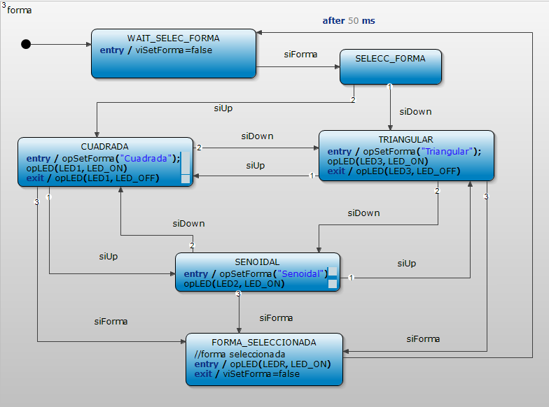
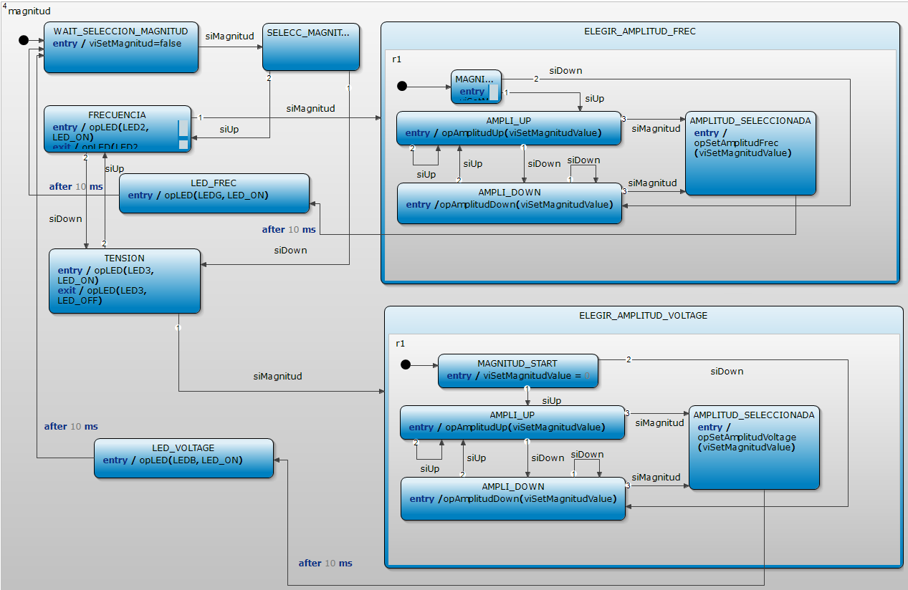
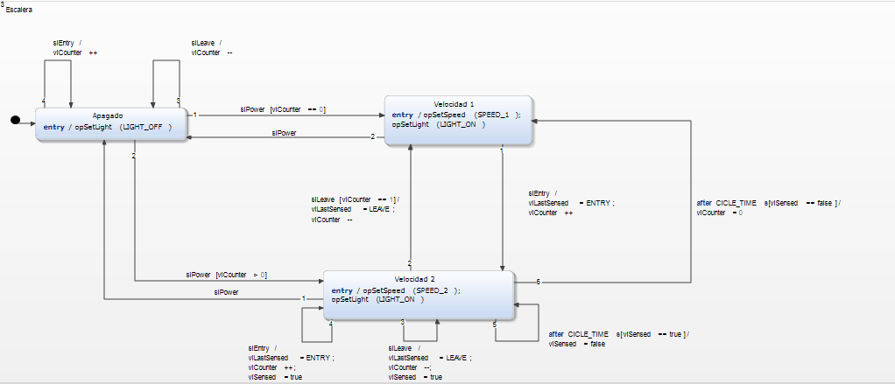

# Trabajo Práctico 1

## Sistemas Embebidos - 2C2021 - Grupo 1

|       Integrante       | Padrón |        Mail        |
|:----------------------:|:------:|:------------------:|
|     Aupi, Santiago     |   100793  |   saupi@fi.uba.ar  |
| Piperno, Ignacio       | 100677 | ipiperno@fi.uba.ar |
|    Rossi, Francisco    |  99540 |  frrossi@fi.uba.ar |

## Índice

- [Trabajo Práctico 1](#trabajo-práctico-1)
  - [Sistemas Embebidos - 2C2021 - Grupo 1](#sistemas-embebidos---2c2021---grupo-1)
  - [Índice](#índice)
- [Resumen](#resumen)
- [Funciones auxiliares](#funciones-auxiliares)
  - [TECX](#tecx)
  - [main_region](#main_region)
- [Ejercicio 3](#ejercicio-3)
- [Ejercicio 4](#ejercicio-4)
- [Ejercicio 5](#ejercicio-5)
- [Ejercicio 6](#ejercicio-6)
- [Ejercicio 7](#ejercicio-7)
- [Ejercicio 8](#ejercicio-8)


# Resumen

En este repositorio se desarrollará el trabajo práctico numero 1 de la materia 86.65 - Sistemas Embebidos, FIUBA. El mismo consiste de 6 ejercicios, cuyas resoluciones podrán encontrar en este repositorio. En este informe desarrollaremos la explicación de cada uno de los ejercicios.

# Funciones auxiliares

En los diferentes ejercicio desarrollados, utilizaremos dos bloques de maquina de estados ya desarrollada, que nos permiten interactuar con el programa mediante la botonera de la placa `EDU-CIAA-NXP`.

## TECX

Este pedazo de codigo nos permite detectar si un pulsador es accionado, tiene un debouncer incorporado y nos devuelve un valor determinado dependiendo de qué pulsador es el que disparó el evento.

|    TEC4   |    TEC3   |    TEC2   |    TEC1   |
|:---------:|:---------:|:---------:|:---------:|
| 8 [b1000] | 4 [b0100] | 2 [b0010] | 1 [b0001] |

El diagrama de la maquina de estados es:


## main_region

En la `main_region` tenemos el "handler" de los eventos dados por TECX, donde dependiendo del ejercicio que estemos resolviendo cambiara levemente, pero fundamentalmente se define qué hacer para cada uno de los pulsadores, a continuación, como ejemplo podemos ver `main_region` del [Ejercicio 5](#ejercicio-5)


# Ejercicio 3

> Implementar (editar, simular y generar el código) el modelo de control de Panel de Control de un generador de señales (tensión de 0 a
10V, frecuencia de 20 a 20.000Hz y 3 formas de señal).
>
> 1. Editar y simular
> 2. Generación de código


Autor: Santiago Aupi

***
Codigo fuente: [ej3](ej3)

Para implementar el sistema que pide el enunciado se definen los siguientes eventos internos:

1. `siTECXOK`: 
	Este evento confirma que se oprimió un botón.
2. `siForma`:
	Este evento da lugar a la selección de la forma de onda: _triangular_, _senoidal_ o  _cuadrada_.
3. `siMagnitud`:
	Este evento da lugar a la configuración de la _frecuencia_ y la _tensión_.
4. `siUp`:
	Con este botón se seleccionan las opciones en cada uno de los menús previos.
5. `siDown`:
 	Con este botón se seleccionan las opciones en cada uno de los menús previos.

Se definen también 5 estados principales: 
1. **TRIANGULAR**
2. **SENOIDAL**
3. **CUADRADA**
4. **FRECUENCIA**
5. **TENSIÓN**

Cada uno de estos estados abre lugar a la configuración de determinado tipo de señal o magnitud. En la siguientes figuras se observa la **máquina de estados** diseñada.





El funcionamiento del programa es el siguiente: se arranca en un estado de reposo, hasta que se presiona algún botón, ya sea `TEC1` o `TEC2`. Presionando `TEC1`se accede al menú de selección de forma de onda: presionando `TEC3` y `TEC4` se avanza o retrocede respectivamente en dicho menú, es decir las opciones _SENOIDAL_, _CUADRADA_ y _TRIANGULAR_. Para confirmar la selección se debe presionar nuevamente `TEC1`. 
Para seleccionar la magnitud, ya sea frecuencia o tensión el proceso es similar. Presionando 1 vez `TEC2` se accede al menú que permite seleccionar qué magnitud se modificará: frecuencia o tensión, y con `TEC3` y/o `TEC4` se efectúa dicha selección. Para confirmar se debe presionar nuevamente `TEC2` y ahí se procede a determinar el valor de la magnitud elegida mediante los pulsadores  `TEC3` y/o `TEC4`. Nuevamente, para confirmar la selección se debe presionar `TEC2`.


Con fines de poder testear el código de forma visual con la placa EDU-CIAA se configuraron los leds integrados para que se prendan al ingresar a un menu y seleccionar una opción. 

Finalmente se tienen las siguientes acciones, que para propósito del _proof of concept_ no han sido implementadas con su funcionalidad real, se exhibe el prototipo de cada una:

```c
void ej3Iface_opSetForma(const Ej3* handle, const sc_string Forma);

void ej3Iface_opAmplitudUp(const Ej3* handle, const sc_integer Amplitud);

void ej3Iface_opAmplitudDown(const Ej3* handle, const sc_integer Amplitud);

void ej3Iface_opSetAmplitudFrec(const Ej3* handle, const sc_integer Amplitud);

void ej3Iface_opSetAmplitudVoltage(const Ej3* handle, const sc_integer Amplitud);
```

# Ejercicio 4

> Implementar (editar, simular y generar el código) el modelo de control de Puerta Corrediza automatizada (motor con movimiento en dos
sentidos, sensor de presencia y fines de carrera)
>
> 1. Editar y simular
> 2. Generación de código


Autor: Santiago Aupi

***
Codigo fuente: [ej4](ej4)

Con el objetivo de diseñar un sistema que cumpla con lo descripto por el enunciado se diseñan los siguientes eventos internos, siguiendo el mismo esquema que ya fue descripto:

1. `siTECXOK`:
	Este evento confirma que se oprimió un botón.
2. `siSensor`:
	Este evento marca que el sensor de proximidad de la puerta detectó un obstáculo.
3. `siClosed`:
	Este evento determina el fin de carrera al cerrar la puerta.
4. `siOpen`:
	Este evento determina el fin de carrera al abrir la puerta.

Los estados definidos para el sistema son 

1. **PUERTA CERRADA**
2. **PUERTA ABIERTA**
3. **PUERTA A CERRAR**
4. **CERRANDO**
5. **OBSTACULO**
6. **FUERA DE SERVICIO**

En la siguiente figura se puede observar la **máquina de estados** diseñada con la herramienta `Yakindu`:


El funcionamiento del sistema es el siguiente. Se espera la señal proveniente del sensor de movimiento, mapeada con el botón `TEC 1` de la placa `EDU-CIAA-NXP` para fines didácticos. Si la puerta se encuentra cerrada entonces procede a abrirse y luego de cierto tiempo que la puerta se encuentra abierta se pasa al estado **PUERTA A CERRAR** donde se espera por una señal del sensor o un tiempo de 100ms para pasar al siguiente estado, que será **CERRANDO**. Una vez en este estado se ejecuta la función encargada de cerrar la puerta, y dicha acción se interrumpirá en cualquier momento que ocurra la señal `siSensor`, que se da cuando el sensor de proximidad detecta un obstáculo. Para verificar el correcto funcionamiento del sistema se asignaron leds a cada uno de los estados principales, para determinar cuando la puerta está abierta, cerrada y cuando se está cerrando . Del mismo modo se armó una secuencia en la que titilan 2 leds para indifcar que la puerta está fuera de servicio. Esto ocurriría en el caso de que la puerta se estuviera cerrando por un tiempo excesivamente grande sin ser interrumpida por el sensor de proximidad, lo cual indica que si la puerta no llegó a cerrarse (porque no ocurrió el evento que indica fin de carretera) luego del tiempo máximo estableido, hay un problema con los motores y se entra al etado **FUERA DE SERVICIO**.

A continuación se exhiben los prototipos de las funciones que se encargan del accionamiento del motor.
```c
void puerta_corredizaIface_opCloseDoor( Puerta_corrediza* handle, sc_integer DOOR_Number );
void puerta_corredizaIface_opOpenDoor( Puerta_corrediza* handle, sc_integer DOOR_Number );
```

# Ejercicio 5

> Implementar (editar, simular y generar el código) el modelo de control de Portón Levadizo automatizado (motor con movimiento en dos
sentidos, control remoto de apertura/cierre, fines de carrera y señalización luminosa)
>
> 1. Editar y simular
> 2. Generación de código

Autor: Francisco Rossi

***
Codigo fuente: [ej5](ej5)

Teniendo en cuenta el enunciado se definen los siguientes eventos:

1. `evCerrarPorton`:
    El mismo define el evento de indicar con el control remoto que se cierre la puerta.

2. `evAbrirPorton`
    Este se define al igual que el anterior, pero cuando se indicar de abrir la puerta.

3. `evFinalCarrera`
    Este evento indica que se detecto un final de carrera, puede ser tanto el de subida como el de bajada.

4. `evObstaculo`
    Est evento indica que existe un obstaculo, si bien no estaba en el enunciado, por la seguridad del mismo lo agregamos al diseno.

Luego, se definen 5 estados, los nombres de los mismos son autoexplicativos:

1. **Cerrado**
2. **Abierto**
3. **Abriendo**
4. **Cerrando**
5. **Parado**, en este caso vale la pena decir que se trata de un punto medio entre abierto y cerrado (en caso de obstaculo).

La **máquina de estados** puede observarse en la siguiente figura:


Por simplicidad se elije que un mismo evento abre o cierre el porton (un solo boton del control remoto), dependiendo del estado en el que este justo antes de presionarlo.

El programa, inicia en estado cerrado, hasta que se le de la indicacion de abrir y este entonces procedera abrirse (es decir, hasta que se detecte el final de carrera superior), en caso de que haya un obstaculo, se enviara una senal al porton para frenar y se esperar 1s para retomar la accion y asi sucesivamente hasta que no exista mas el obstaculo. Una vez que esta abierto sucede lo equivalente para cerrarse.

Las siguientes funciones son las ejecutadas al ingresar en cada uno de los estados. De esta manera se inician las acciones de abrir, cerrar o de parar el porton, segun corresponda.

```c
void ej5_opAbrirPorton(Ej5* handle, const sc_integer PortNumber){
  gpioWrite(LED1, true);
  //accionarMotor(arriba)
}
void ej5_opCerrarPorton(Ej5* handle, const sc_integer PortNumber){
  gpioWrite(LED2, true);
  //accionarMotor(abajo)
}
void ej5_opPararPorton(Ej5* handle, const sc_integer PortNumber){
  gpioWrite(LED3, true);
  //accionarMotor(frenar)
}
```

En este caso solo se estan llevando a cabo la senalizacion de los LEDS. Pero, en caso de tener realmente el motor, se accionaria el mismo correspondientemente (a esto refiere `accionarMotor()`).

Se verificó el funcionamiento del mismo tanto en el simulador de `Yakindu` como en la placa `EDU-CIAA-NXP` al iniciar en estado cerrado con `TEC 1` efectuamos el evento de abrir el portón, se encenderá el `LED 1`, luego con `TEC 3` podemos indicar que el sensor detecto un obstáculo, encendiendo el `LED 3` por 1 segundo y luego retornando a la apertura. Por otro lado, con `TEC 4` indicamos el final de carrera, luego con `TEC 2` accionamos el evento de cerrar el portón, también pudiendo interrumpirlo con `TEC 3` como obstáculo.

# Ejercicio 6

> Implementar (editar, simular y generar el código) el modelo de control de Escalera Mecánica unidireccional automatizada (motor
c/movimiento en un sentido y dos velocidades, sensores de ingreso, egreso y señalización luminosa)
>
> 1. Editar y simular
> 2. Generación de código

Autor: Ignacio Piperno

***
Código fuente: [ej6](escalera)

Teniendo en cuenta el enunciado se definen los siguientes eventos:

1. `siEntry`:
    El evento corresponde a que suba una persona a la escalera.
2. `siLeave`:
    El evento corresponde a que baje una persona de la escalera.
3. `siPower`:
    El evento corresponde a que presionen un boton de encendido/apagado. Este evento fué agregado a criterio propio.
    
Luego, se definen 3 estados:

1. **Apagado** Corresponde a si la escalera se encuentra totalmente frenada. Es un estado inicial en el que la escalera se encuentra conectada, pero no en movimiento. Se señaliza que está frenada mediante el `LEDR` encendido.
2. **Velocidad 1** Corresponde a si la escalera se encuentra en movimiento pero sin personas en ella, en la velocidad lenta. Se señaliza que está en movimiento `LEDG` encendido, y que está en velocidad 1 con el `LED1`.
3. **Velocidad 2** Corresponde a si la escalera se encuentra en movimiento con personas arriba, en la velocidad rápida. Se señaliza que está en movimiento con `LEDG` encendido, y que está en velocidad 2 con el `LED2`.

La **máquina de estados** puede observarse en la siguientes figura:



La escalera comienza en modo apagado, es decir, se encuentra frenada hasta que se la active. Estando frenada, cuenta si suben o bajan personas, para que al momento de prenderse arranque en la velocidad indicada. Al prenderse, si no hay personas arriba, arranca en la velocidad lenta. Cuando se sube una persona, la escalera cambia a velocidad rápida, y se cuentan las personas que suben y bajan para que cuando el contador llegue a 0, se vuelva a la velocidad lenta ya que no se encuentra nadie en la escalera.

Se agregó una condición de tiempo, para que en caso de que se haya sensado accidentalmente que alguien subió, o no se haya sensado que alguien bajó, la escalera no se quede indefinidamente en la velocidad 2. Funciona de la siguiente manera: Si la escalera hace un ciclo (es decir, el primer escalón llega al final) y no se sensó que nadie subió ni bajó, se espera un ciclo más, y si se sigue sin haber sensado a ninguna persona, se reinicia el contador de personas y se vuelve a la velocidad lenta.

La escalera puede ser frenada en cualquiera de las 2 velocidades. El contador va a mantenerse si la escalera se frena, y se van a seguir sensando las personas que suben y bajan, de manera tal de que al volver a prenderse, se inicie en la velocidad correcta.

Las siguientes funciones son ejecutadas al momento de ingresar en cada estado correspondiente (se pueden ver en el diagrama de estados anterior).

```c
/*! Esta funcion para o prende la escalera (en este caso apaga y prende el LEDR y el LEDG).
 *  @param handle instancia de máquina de estados
 *  @param state estado anterior de la escalera
 */
void escaleraMecanicaIface_opSetLight(const EscaleraMecanica* handle, const sc_boolean state)
{
	if(state == false){
		gpioWrite( (LEDG), false);
		gpioWrite( (LEDR), true );
		// apaga el motor
	}
	else{
		gpioWrite( (LEDR), false);
		gpioWrite( (LEDG), true);
		// enciende el motor
	}
}

/*! Esta funcion cambia la velocidad del motor.
 *  @param handle instancia de máquina de estados
 *  @param speed  opción de velocidad
 */
void escaleraMecanicaIface_opSetSpeed(const EscaleraMecanica* handle, const sc_integer speed)
{
	if(speed == SPEED_1){
		gpioWrite( (LEDR+3), true);
		gpioWrite( (LEDR+4), false);
		// motor a velocidad 1
	}
	if(speed == SPEED_2){
		gpioWrite( (LEDR+3), false);
		gpioWrite( (LEDR+4), true);
		// motor a velocidad 2
	}
}
```
Se verificó el funcionamiento del mismo tanto en el simulador de `Yakindu` como en la placa `EDU-CIAA-NXP`. Al iniciar, se prende el `LEDR` indicando que la escalera está frenada. Se puede iniciar/frenar la escalera mediante el botón `TEC1`, y al iniciar se apagará el `LEDR` y se encenderá el `LEDG`. Se puede simular que suben personas mediante el botón `TEC2` y que bajan mediante el botón `TEC3`. El `LED1` señaliza que se encuentra en la velocidad lenta y el `LED2` indica que se encuentra en la velocidad rápida. Por último, si se espera varios segundos sin tocar ningún botón en la velocidad 2, la escalera volverá a la velocidad 1.


# Ejercicio 7

> Implementar (editar, simular y generar el código) el modelo de control de Horno Microondas (3 modos de cocción seleccionable por
botón de modo, botón de comenzar/terminar y sensor de apertura de puerta)
>
> 1. Editar y simular
> 2. Generación de código

Autor: Francisco Rossi

***
Código fuente: [ej7](ej7)

Teniendo en cuenta el enunciado se definen los siguientes eventos:

1. `evStartCooking`:
    El evento corresponde a presionar el botón de start.
2. `evStopCooking`
    El evento corresponde a presionar el botón de stop o puede también ser disparado por el sensor de puerta abierta. Lo importante es que al generarse va primero a el estado *Pause* y luego puede retomarse.
3. `evSelectCookType`
    Este evento corresponde a presionar el botón de selección de modo.

Luego, se definen 5 estados:

1. **Idle** Corresponde al estado de *stand-by*. Queda a la espera de la seleccion de un modo de cocción..
2. **Cooking** Corresponde al estado del microndas funcionando.
3. **Pause** Corresponde al estado de **Pause**, dado por presionar el boton de stop una vez o de puerta abierta.
4. **cookType_1** Corresponde al estado de tener seleccionado el modo 1.
5. **cookType_2** Corresponde al estado de tener seleccionado el modo 2.
5. **cookType_3** Corresponde al estado de tener seleccionado el modo 3.

La **máquina de estados** puede observarse en las siguientes figuras:


El flujo del programa se basa en los estados, empieza en estado **Idle**, al seleccionar el modo de cocción mediante el botón de modo, se puede arrancar a cocinarlo, mediante el botón de start. Luego, si durante la cocción se abre la puerta, ya estaba abierta al empezar o se selecciona el botón de parar una vez, se pasa al estado **Pause** donde si se vuelve a presionar el botón de start continua la cocción si la puerta está cerrada, si se presiona el botón de stop entonces vuelve al modo **Idle**.

La selección de los tipos es cíclico, es decir si seguimos presionando el botón de modo luego de estar en el modo 3, volverá al primero.

Las siguientes funciones son las ejecutadas al ingresar en cada uno de los estados. De esta manera se inician las acciones de apagar y prender LEDS, simplemente para tener una forma de visualizar lo realizado en la placa, el programa del microndas deberia resolver cada una de las acciones.

```c
void ej7_opSelectCookType( Ej7* handle, const sc_integer type){
	gpioWrite(LED1, false);
	gpioWrite(LED2, false);
	gpioWrite(LED3, false);
	gpioWrite(LED1 + (type -1),  true);
}
void ej7_opStartCooking( Ej7* handle){
	gpioWrite(LEDR,  false);
	gpioWrite(LEDG,  true);
}
void ej7_opStopCooking( Ej7* handle){
	gpioWrite(LEDG, false);
}
}
```

En este caso solo se estan llevando a cabo la senalizacion de los LEDS. Pero, en caso de tener realmente el microndas, se accionaria el mismo correspondientemente.

Se verificó el funcionamiento del mismo tanto en el simulador de `Yakindu` como en la placa `EDU-CIAA-NXP` al cargarlo el `LEDR` indica el estado **Idle**, luego al presionar `TEC 3` se elije un modo (indicados por `LED1`, `LED2`, `LED3` correspondientemente). Luego con `TEC 1` se incia y `TEC 2` actua como botón de stop.

# Ejercicio 8

>Implementar (editar, simular) el modelo de control de xxxx xxxx (dicho modelo debe ser una parte de la implementación de su TPF)
>
> 1. Editar y simular
> 2. Generación de código
